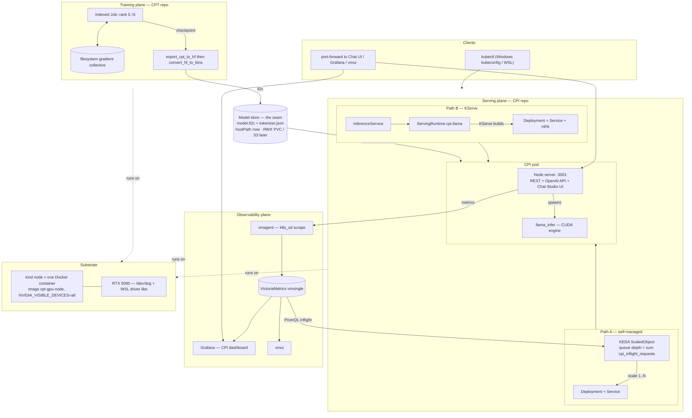

# Platform architecture — train + serve on Kubernetes

One picture of the whole system: **CPT trains, CPI serves, they meet on a model
store**, with observability and autoscaling around the serving plane and two ways
to run it (self-managed, or KServe-managed). Everything below runs today on a
single-node **kind** cluster; the same topology scales to a real multi-node, multi-GPU
cluster by swapping the noted pieces.

## Rendered (Mermaid)



## Universal (ASCII)

```
                                   CLIENTS
                 kubectl (Windows kubeconfig / WSL)   port-forward → UIs
                                      │
 ┌─────────────────────────┐   model store (the seam)   ┌──────────────────────────────┐
 │  TRAINING PLANE (CPT)    │  ┌──────────────────────┐  │   SERVING PLANE (CPI)         │
 │                          │  │ /models              │  │  ┌────────────────────────┐  │
 │  Indexed Job rank 0..N   │  │   model.ll2c         │  │  │ CPI pod                │  │
 │     ▲          │ ckpt    │  │   tokenizer.json     │  │  │  Node :3001 (REST +    │  │
 │     │ gradient ▼         │──▶  hostPath now;       │──▶  │   OpenAI API + Chat UI)│  │
 │  [filesystem collective] │  │  RWX PVC / S3 later  │  │  │      │ spawns          │  │
 │     export_cpt_to_hf ────┼──▶│ (.ll2c)             │  │  │      ▼                 │  │
 │     → convert_hf_to_bins │  └──────────────────────┘  │  │  llama_infer (CUDA)    │  │
 └─────────────────────────┘                             │  └────────────────────────┘  │
                                                         │   served two ways:           │
                                                         │   A) Deployment+Service+KEDA │
                                                         │   B) KServe InferenceService │
                                                         │        → ServingRuntime      │
                                                         └──────────────┬───────────────┘
                                                            /metrics     │   ▲ scale 1..N
                                                                ▼        │   │
 OBSERVABILITY:   vmagent ──▶ VictoriaMetrics ──▶ Grafana / vmui        │   │
                                     └──── PromQL: sum(cpi_inflight) ──▶ KEDA┘
 ─────────────────────────────────────────────────────────────────────────────────────
 SUBSTRATE:  Windows + WSL2 + Docker Desktop → kind (1 node = 1 Docker container,
             image cpt-gpu-node w/ NVIDIA_VISIBLE_DEVICES) → RTX 5090 via /dev/dxg + WSL libs
```

## Component legend

| Component | Role | kind (now) | Real cluster |
|---|---|---|---|
| **CPT Indexed Job** | data-parallel training, gang of ranks | filesystem gradient collective | NCCL + RDMA, gang scheduling |
| **Model store** | the seam CPT writes / CPI reads | `hostPath /tmp/cpt-models` | RWX PVC or S3/MinIO + node cache |
| **CPI pod** | Node web server (API + Chat UI) → `llama_infer` CUDA engine | 1 GPU shared via `/dev/dxg` | `nvidia.com/gpu` on a GPU node pool |
| **Path A: KEDA** | autoscale on queue depth (`cpi_inflight_requests`) | scales 1→3, shared GPU | scale across GPU nodes |
| **Path B: KServe** | model-centric control plane (ISVC → runtime) | RawDeployment, no storageUri | Serverless/Knative, `storageUri` |
| **VictoriaMetrics + vmagent** | metrics TSDB + scrape | `vmsingle` + emptyDir | VM Operator + PVs / cluster mode |
| **Grafana** | CPI dashboard (rate, 409, tokens/s, inflight, latency, replicas) | provisioned, anonymous | SSO, persistent |
| **Substrate** | kind node container + GPU | WSL2 `/dev/dxg` bind-mount | real GPU nodes + device plugin |

## The two serving paths, side by side

| | Path A — self-managed | Path B — KServe |
|---|---|---|
| You declare | Deployment + Service + KEDA `ScaledObject` | one `InferenceService` |
| Who builds the Deployment/Service/HPA | you | KServe controller |
| Autoscale signal | **queue depth** (correct for single-stream) | KServe default **CPU HPA** (swap for queue depth) |
| Best for | full control, custom metrics | model-registry-style multi-model serving |

Detailed docs: [`README.md`](README.md) (serving), [`observability/README.md`](observability/README.md)
(metrics + autoscale), [`kserve/README.md`](kserve/README.md) (KServe path). Training
plane lives in the **CPT** repo under `deploy/k8s/`.
